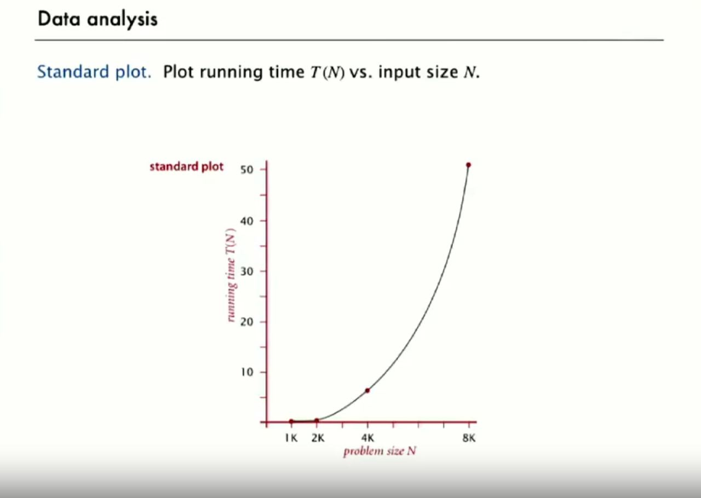
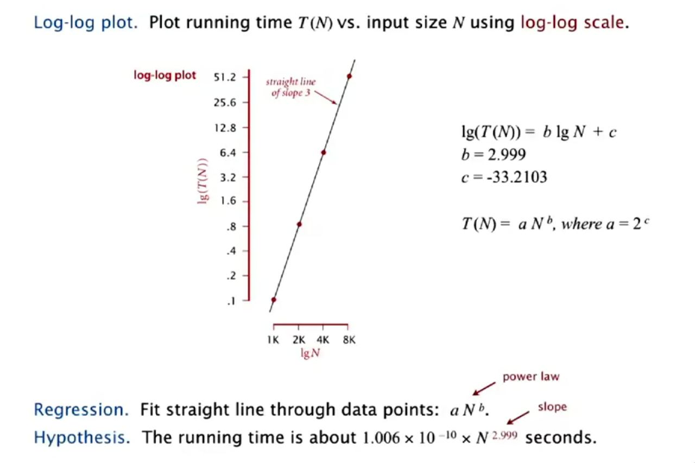

# Analysis of algorithms

## Observations

To calculate a running time we’ll start with an observation of current events, for example the running time of n^3 3-sum algorithm



To determine a running time a log-log plot is used, so we’ll put our data on it.




We assume `T(n) = a^b` for come constants `a` and `b`  
As we double the input size, we look at the running time increase  
That indicates a quadratic algorithm, or `b = 2` (`b` is also the slope of log-log plot), which can also be found running a regression:  

%5Csim%20b%5Clog_%7B2%7D%5Cleft(x_%7B1%7D%5Cright)&plus;c)

Plugging in:
```
T(8000) = 51.2
51.2 = a * 8000^3
a = 51.2 / 8000^2 ~= 1.006 * 10^-10 * n^3
```

So the function that models the running time of n^3 3-sum algorithm is  
`1.006 * 10^-10 * n^3`


