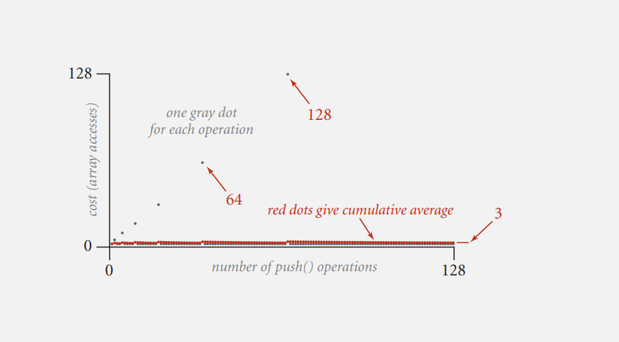

# Stacks and queues

## Stacks
- Linked list implementation O(1) add/remove ops
- Array implementation 

An array stack implementation suffers from resizing problem.  
Even if we are not going to increase its size by 1 on each insertion (O(n2)) and try to solve it by repeated doubling, we run into **thrashing** problem:  
When we at the end of an array's capacity, and the next insertion is going to double its size
If we want to remove an item next step, we're going to need to halve its size.  
So if an array is full, push-pop alternating sequence takes time proportional to amount of an array items (n), resulting n2 cost of all operations.  
We can avod thrashing by halving the array not when its half full, but when its one-quarter full.

Amortized analysis: when we consider the total cost averaged over all operations.  
For example, repeated doubling resizing an array costs 3n every resizing, and that's a lot  
But if we average this number by number of push operations, we'll see a constant time graph  

## Elementary sorts
What's interesting is that a shellsort is based on using insertion sort.  
So the basic principle is repeatedly h-sort a sequence. An h-sorted sequence is h interleaved sorted subsequences. Put simply, we just make h subsequences sorted with a step of h. Why an insertion sort? If the increments are big, the size of sub-arrays that we're sorting are small, so any method including insertion sort is going to work. The other thing is, if the increments are small, because we've done previous h-sorts for bigger values of h the array is partially sorted, and insertion sort is fast on partially sorted arrays (close to O(n)). So the implementation of a shellsort is determining an increment sequence - sequence of h's that we need to sort our array with until it is sorted (h = 1).   
The most famous one - Knuth's is 3x+1