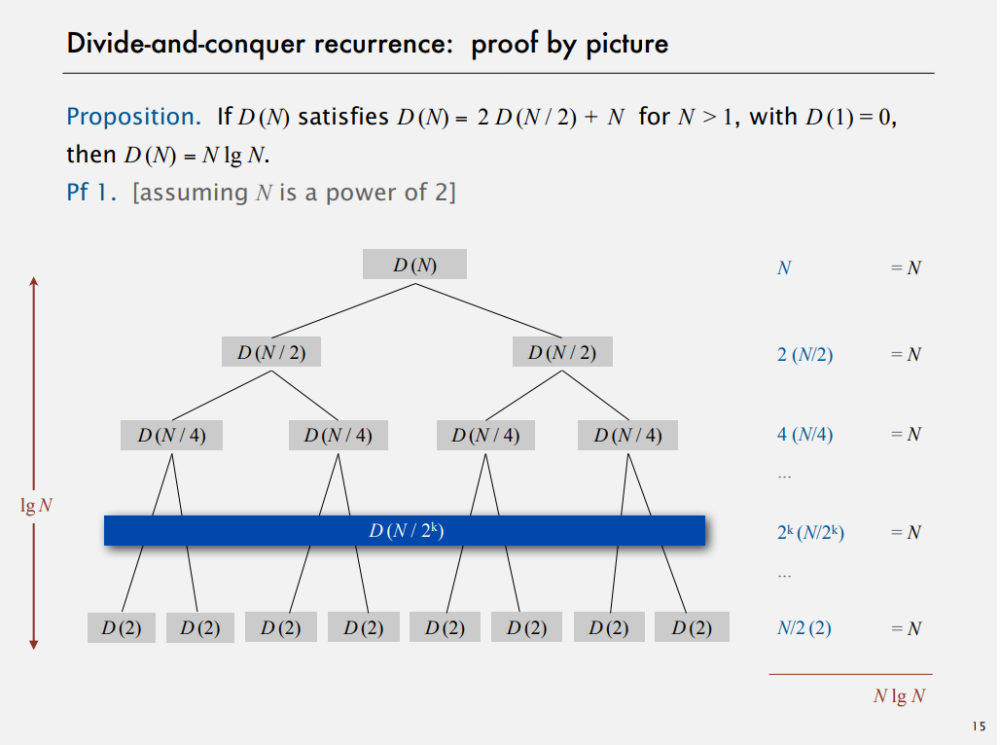
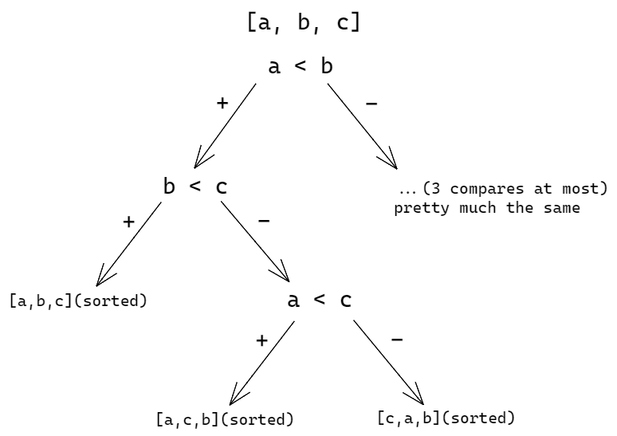
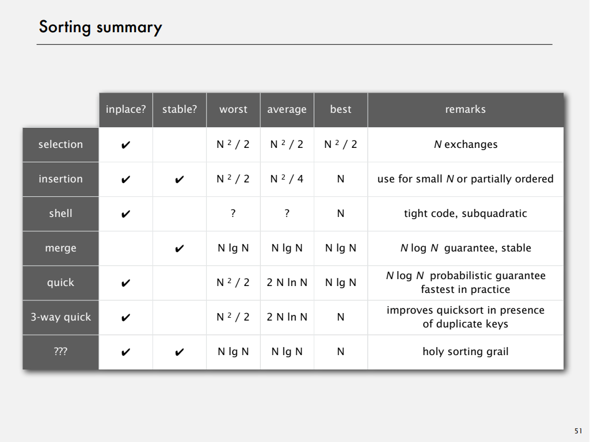

# Week 3: Mergesort

## Programming Assignment: Collinear Points

[Specification](https://coursera.cs.princeton.edu/algs4/assignments/collinear/specification.php)

# Notes

## Mergesort

### Divide and conquer recurrence

How many steps it takes to divide until the base case? It's the number of times you divide n by 2 to get down to 2 that is exactly log base 2 of n.

### Mergesort improvements

Mergesort is too complicated to use for small arrays. It adds a lot of overhead to create subarrays. So the first improvement is to use insertion sort for small subarrays. The second improvement we can make is just stop and not proceed merge when array is part sorted, for example when we have an array where a last element in a first half is less or equal to the smallest element in the second half ([1, 2, 3, **4**, **5**, 6, 7, 8]).

### Sorting complexity

The idea of complexity is a framework for studying the efficiency of all the algorithms for solving a particular problem. That's computational complexity.  
To analyze sorting complexity we need:

- model of computation - that will be allowable operations
- we are going to count operations, and thats a cost model
- we need to find out upper bound - cost guarantee, thats provided by some algorithm for solving the problem, how difficult it is to solve the problem
- we also look for a lower bound - a limit on cost guarantee of all algorithms, which means no algorithm can do better
- then we need an optimal algorithm, that's where we prove that lower bound ~ upper bound

In example for sorting, what each of these are

- model of computation: decision tree
- cost model: # of compares
- upper bound: N lg N for mergesort
- lower bound - ?
- optimal algorithm - ?

Let's prove a lower bound for sorting. That's a decision tree

  
In this example, if you go from top to bottom in the tree with three compares **at most** you can determine the ordeting of the three different items.  
The height of the tree is **worst-case** number of compares.  
So the proposition that uses the decision tree is to prove that any compare base sorting algorithm has to use at least lg(N!) compares. And by Stirling's approximation we know that lg(N!) ~ N lg N  
Assume that array constists of N distinct values `a_1` through `a_N`. This tree has to have at least `N!` leaves, and if the tree of height `h`, its has at most `2^h` leaves. `N! <= #leaves <= 2^h` which `h >= lg(N!) ~ N lg N`  
That's a lower bound on the complexity of sorting.  
So now we have lower bound which is the same as upper bound, that means we have mergesort as an optimal algorithm.  
That's the first goal of algorithm design - is to try and find an optimal algorithm for problems that we need to solve.

The other thing is that the lower bound might not hold if the algorithm has more info about:

- the order (for example if it's known that the input is almost ordered, insertion sort can be linear time)
- the distribution of keys (if there are a lot of equal keys, we can get it sorted fasted than N lg N, i.e 3-way quicksort)

## Quicksort

The algorithm for a quicksort is:

- Shuffle the array
- Partition the array, so that for the partition point `j` everything to the left of `j` is not greater than `j`, and to the right of `j` is not smaller than `j`
- Sort each partition from 0 to `j-1` and from `j+1` to end recursively, cause the element `j` is in place after first partitioning

One of the big advantages of Qs over Ms is that Quicksort doesn't take any extra space.  
Shuffling at the beginning is needed for _performance guarantee_. The guarantee it gives us is that the worst case is not going to happen.

### Quicksort analysis

Number of compares:

- Best: `n log n`
- Worst: `1/2 n^2` (if random shuffle ends up putting items exactly in order)
- Average: `2n ln n` (actually as an array gets larger it gets closer to `1.39n ln n`)

With random shuffle the worst-case scenario is very unlikely to happen.  
So the number of compares in Quicksort is more than in Mergesort, but Qs is faster cause it doesn't do much corresponding to each compare, it just compares and increments the pointer.

Quicksort properties:

- In place
- Recursion depth: logarithmic
- Not stable

### Quicksort improvements

Insertion sort on small subarrays:

- Each quicksort has too much overhead for tiny subarrays
- Cutoff to insertion sort for ~10 items
- _Note_: you could delay the insertion sort until one pass at the end

For cutoff, any value between 10 and 20 will improve the running time around 20%.

## Selection

_Goal_: given an array of N items find the `k^th` largest.

### Use theory as a guide

- Easy `n log n` upper bound (efficient sorting)
- Easy `n` upper bound for k = 1, 2, 3 (linear scan)
- Easy `n` lower bound (because you have to look at everything)

The answer is Quick-select method.
It is based on a partitioning method, which is used in Quicksort.
The algorithm is:

- Partition the array as in quicksort
- Repeat partitioning in **one** subarray depending on a partition point `j`.
- Proceed partitioning with left if `a[k]` is to the left of the point and vice-versa.

## Duplicate keys

What to do if there is a lot of duplicate keys present in an array?

For Mergesort it doesn't matter much what the key values are like - number of compares always is between `1/2 n log n` and `n log n` compares.
For Quicksort until 1990s the most widely used implementation took quadratic time with a lot of duplicates in an array.  
So for the recommended Qs implementation it stops scan on items equal to the partitioning item `j` (`n log n` compares when all keys are equal)

> But if you think about it, it is better if we put all items equal to the partitioning item in place?
> _Goal_ partition array into 3 parts so that:

- Entries between `lt` and `gt` are equal to partition item `a[lo]`
- No larger element to the left of lt
- No smaller element to the right of gt

Dijkstra 3-way partitioning:

- Let `v` be partitioning item `a[lo]`
- Scan `i` from left to right
  - `a[i] < v` -> swap `a[lt]` with `a[i]`, increment `i` and `lt`
  - `a[i] > v` -> swap `a[gt]` with `a[i]`, increment just `gt`
  - `a[i] == v` -> just increment i

The lower bound of 3-way qs is depended on the keys being distinct. Also, the number of compares that it uses is `n log n` when all the keys are distinct and linear time if a constant number of distinct keys.

> The bottom line is randomized Quicksort with 3-way partitioning reduces running time from linearithmic to linear in broad class of applications.

The goal of 3-way partitioning is to speed up quicksort in the presence of _duplicate keys_.

## System sorts

The key question is which algorithm to use?
Depends on application attributes:

- Does it need to be stable or not?
- Parallel?
- Deterministic?
- Keys all distinct?
- Multiple key types?
- Linked list or array?
- Large or small items?
- Is input randomly ordered?
- Need guaranteed performance?

So, here's the summary:

