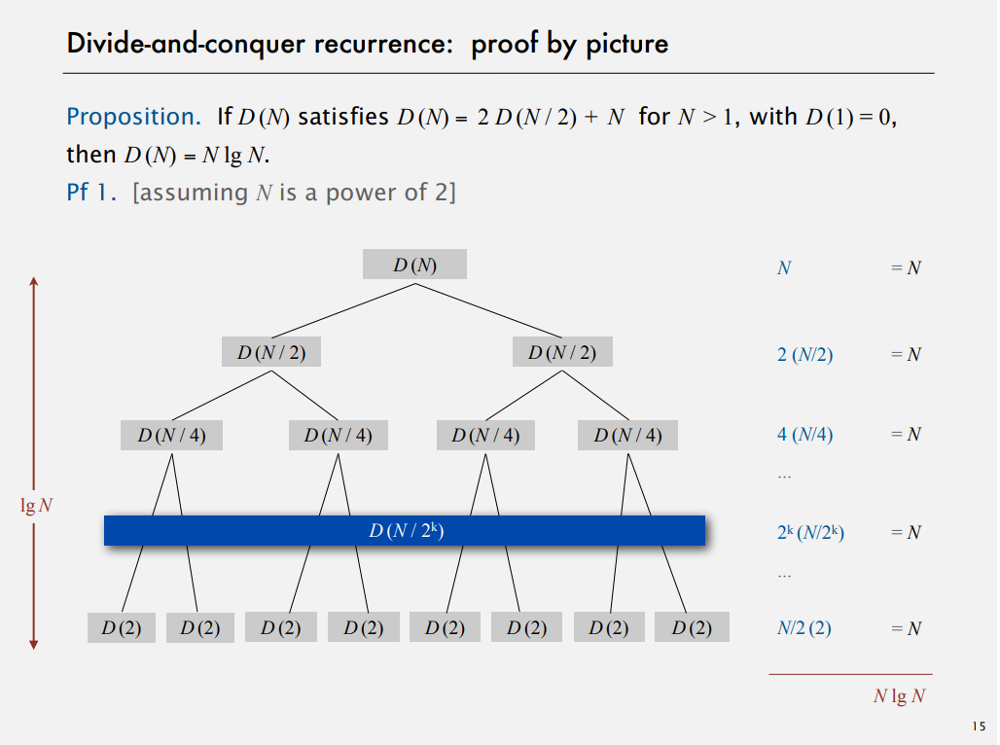

# Mergesort  
## Divide and conquer recurrence  

How many steps it takes to divide until the base case? It's the number of times you divide n by 2 to get down to 2 that is exactly log base 2 of n.  

## Mergesort improvements

Mergesort is too complicated to use for small arrays. It adds a lot of overhead to create subarrays. So the first improvement is to use insertion sort for small subarrays. The second improvement we can make is just stop and not proceed merge when array is part sorted, for example when we have an array where a last element in a first half is less or equal to the smallest element in the second half ([1, 2, 3, **4**, **5**, 6, 7, 8]).

## Sorting complexity
The idea of complexity is a framework for studying the efficiency of all the algorithms for solving a particular problem. That's computational complexity.  
To analyze sorting complexity we need:
+ model of computation - that will be allowable operations
+ we are going to count operations, and thats a cost model
+ we need to find out upper bound - cost guarantee, thats provided by some algorithm for solving the problem, how difficult it is to solve the problem
+ we also look for a lower bound - a limit on cost guarantee of all algorithms, which means no algorithm can do better
+ then we need an optimal algorithm, that's where we prove that lower bound ~ upper bound

In example for sorting, what each of these are
+ model of computation: decision tree
+ cost model: # of compares
+ upper bound: N lg N for mergesort
+ lower bound - ?
+ optimal algorithm - ?

Let's prove a lower bound for sorting. That's a decision tree  
  
In this example, if you go from top to bottom in the tree with three compares **at most** you can determine the ordeting of the three different items.  
The height of the tree is **worst-case** number of compares.  
So the proposition that uses the decision tree is to prove that any compare base sorting algorithm has to use at least lg(N!) compares. And by Stirling's approximation we know that lg(N!) ~ N lg N  
Assume that array constists of N distinct values `a_1` through `a_N`. This tree has to have at least `N!` leaves, and if the tree of height `h`, its has at most `2^h` leaves. `N! <= #leaves <= 2^h` which `h >= lg(N!) ~ N lg N`  
That's a lower bound on the complexity of sorting.  
So now we have lower bound which is the same as upper bound, that means we have mergesort as an optimal algorithm.  
That's the first goal of algorithm design - is to try and find an optimal algorithm for problems that we need to solve.  

The other thing is that the lower bound might not hold if the algorithm has more info about:  
+ the order (for example if it's known that the input is almost ordered, insertion sort can be linear time)
+ the distribution of keys (if there are a lot of equal keys, we can get it sorted fasted than N lg N, i.e 3-way quicksort)
